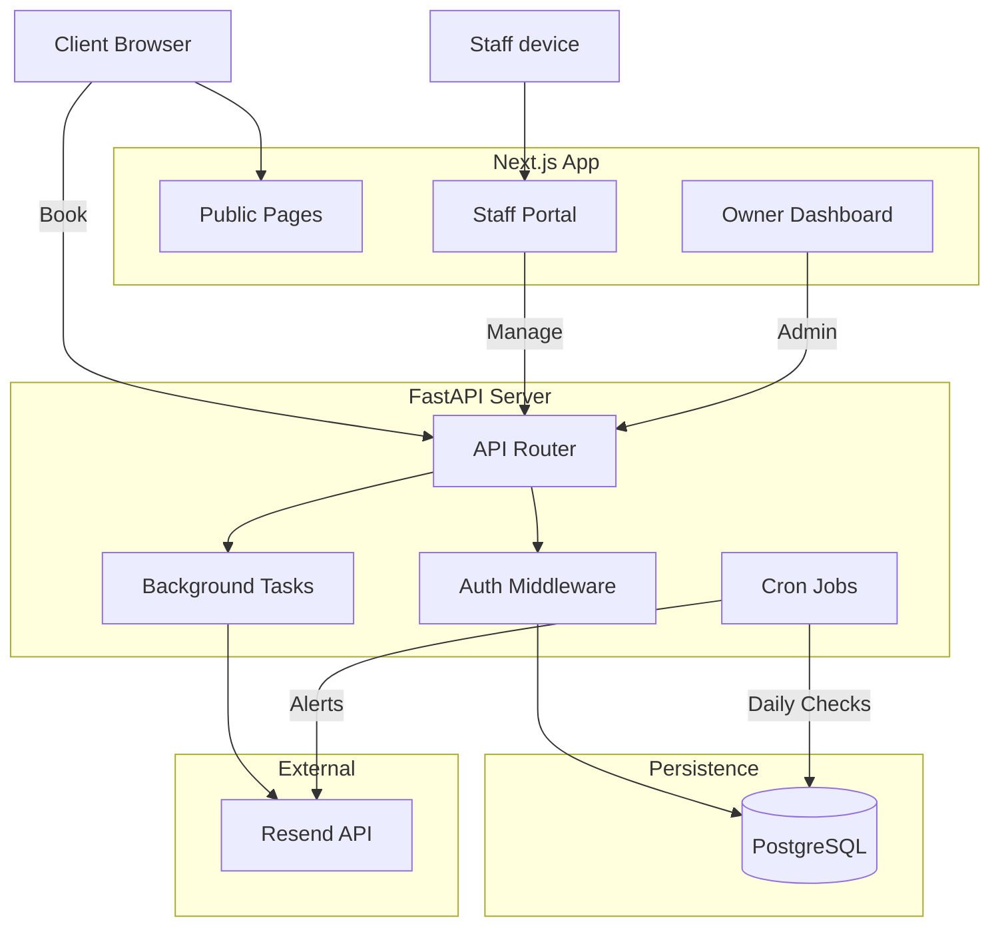

# CareOps System Architecture

## 1. High-Level Overview
**CareOps** is a "Business Operating System" for service-based businesses (Salons, Spas, etc.). unlike typical booking apps, it focuses on **Operational Health** (Inventory, Staff Clarity, Owner Peace of Mind).

### Tech Stack
-   **Frontend**: Next.js 14, React, TailwindCSS, Shadcn UI.
-   **Backend**: FastAPI (Python), SQLModel/SQLAlchemy.
-   **Database**: PostgreSQL (Production) / SQLite (Dev/Test).
-   **Async**: Python `BackgroundTasks` for emails, Cron for automation.
-   **Email**: Resend API (Transactional + Alerts).

---

## 2. Infrastructure Diagram

---

## 3. Database Schema (Core Models)

### `Workspace`
The tenant root.
-   `id`, `slug` (public URL), `name`
-   `email_config` (JSON providers)
-   `is_active` (Boolean)

### `User`
Staff and Owners.
-   `role`: "owner" | "staff"
-   `permissions`: JSON (e.g. `{"bookings": true}`)
-   `hashed_password` (Salted bcrypt)

### `Service`
-   `name`, `duration`, `price`
-   `inventory_item_id` (Link to stock)
-   `inventory_quantity_required` (Auto-deduct amount)

### `InventoryItem`
-   `quantity`, `threshold` (Low stock alert trigger)
-   `last_alert_at` (Prevents spam)

### `Booking`
-   `status`: "pending" | "confirmed" | "cancelled"
-   `follow_up_sent`: Boolean (V2 Automation)
-   `start_time`, `end_time`

---

## 4. Core Modules & Functions

### A. Onboarding (`api/onboarding.py`)
*Public & Unauthenticated Setup.*
-   `create_workspace`: Generates unique slug, creates Owner.
-   `create_services`: Bulk creation with Inventory linking.
-   `create_inventory`: Bulk stock setup.
-   `activate_workspace`: Final validation check.

### B. Bookings (`api/bookings.py`)
*The "Brain" of the operation.*
-   `create_booking`: 
    1.  Validates Time Slot (Overlap check).
    2.  **Auto-Deducts Inventory** (V2).
    3.  Triggers Low Stock Alert if needed.
    4.  Creates Contact if new.
    5.  Queues Confirmation Email.
-   `cancel_booking`: Updates status, sends cancellation email.

### C. Staff Management (`api/staff.py`)
*Secure Staff Access.*
-   `invite_staff`: 
    1.  Generates **Random Password** (V2 Security).
    2.  Hashes it.
    3.  Sends credentials **via Email only** (never returns in API).
-   `read_staff`: Lists active staff.

### D. Dashboard (`api/dashboard.py`)
*The "Pulse" of the business.*
-   `get_stats`: Aggregates:
    -   `upcoming_24h` bookings.
    -   `unanswered` messages.
    -   `low_stock` items.
    -   `pending` forms.

### E. Automation (`api/cron.py`)
*The "Robot Employee".*
-   `run_cron_jobs`:
    -   **Reminders**: 24h before appointment.
    -   **Follow-ups**: 1h after appointment (V2 Polished).
    -   **Owner Alerts**: Daily summary of issues.

### F. Communication (`services/email.py`)
*The "Voice" of the business.*
-   `send_booking_confirmation`
-   `send_staff_invite`
-   `send_inventory_alert`
-   `send_visit_completion` (Feedback loop)

---

## 5. Key Workflows

### 1. The "Perfect Booking" Flow
1.  **Customer** visits `/book/urbanglow`.
2.  Selects "Hair Coloring" (Service).
3.  **System** checks "Red Dye" stock (Inventory).
4.  If Stock > 0:
    -   Deducts 1 Unit.
    -   Creates Booking.
    -   Sends Confirmation Email to Customer.
    -   Sends "New Booking" Email to Owner/Staff.
5.  If Stock hits limit -> **System** emails Owner: "Order Red Dye now!".

### 2. The "Staff Start" Flow
1.  **Owner** invites "Sarah".
2.  **System** generates password, emails Sarah.
3.  **Sarah** clicks link, logs in.
4.  **System** detects `role="staff"`.
5.  Redirects to `/staff` (Restricted Dashboard).
6.  Sarah sees *only* her Bookings and Messages.

### 3. The "Retention" Flow
1.  **Customer** completes visit.
2.  **System Cron** runs every hour.
3.  Detects visit ended > 1 hour ago.
4.  Checks `follow_up_sent == False`.
5.  Sends "Thank You / Rate Us" email.
6.  Marks `follow_up_sent = True`.
